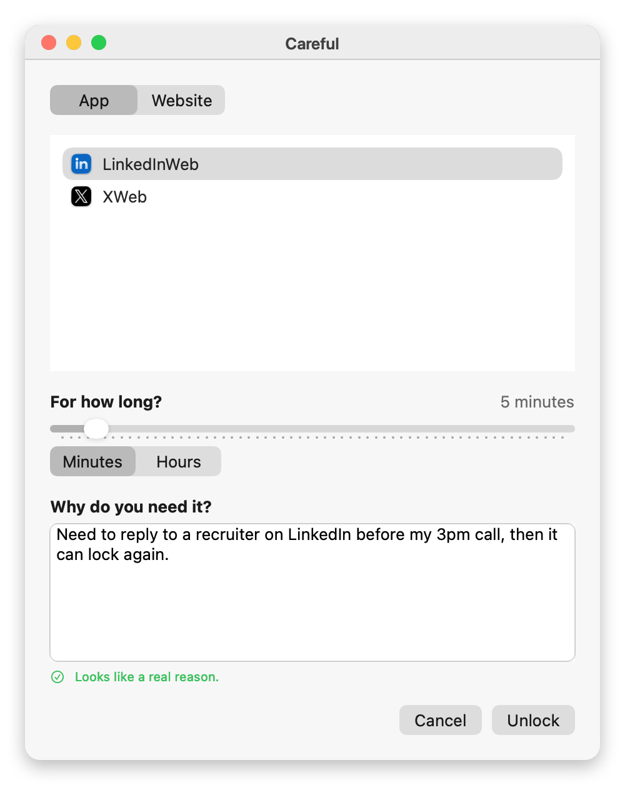
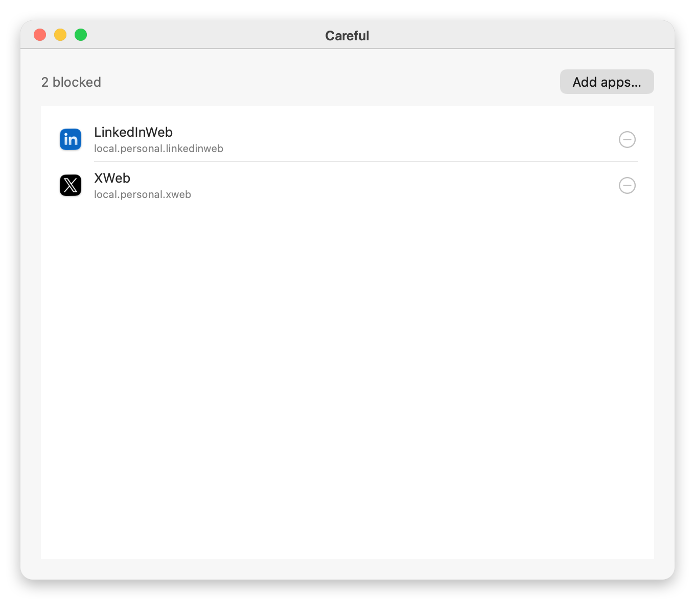

<p align="center">
  <picture>
    <source media="(prefers-color-scheme: dark)" srcset="docs/banner-dark.png">
    
  </picture>
</p>

<p align="center">
  <a href="#install">Install</a> ·
  <a href="#how-it-works">How it works</a> ·
  <a href="#the-command-line">Command line</a> ·
  <a href="#why-some-things-are-the-way-they-are">Design notes</a> ·
  <a href="https://github.com/alexanderjmontague/careful-ios">iPhone version</a>
</p>

---

Careful is a distraction blocker for the Mac. It blocks apps and websites on a schedule,
and it doesn't have a "pause everything" button.

When you need something, you unlock one app or one website, for a length of time you pick,
and you type a reason. The rest stays blocked. When the time is up it locks again by itself.
Every unlock and its reason is kept in a log you can read later.

<p align="center">
  <picture>
    <source media="(prefers-color-scheme: dark)" srcset="docs/mac-unlock-dark.png">
    
  </picture>
</p>

The reason has to be an actual sentence: at least 40 characters and 6 words, mostly real
words according to the system spell checker, and not one phrase repeated. `i need it
because im tired` gets rejected, so does `als;djaskdj`.

## Features

- **App blocking.** Blocked apps are quit as soon as they open. This includes apps that
  launch in the background and apps that were already running when the block started.
- **Website blocking inside the browser.** Careful watches open tabs in Chrome, Dia, Arc,
  Brave, Edge, Comet, Vivaldi, Opera and Safari, and redirects blocked pages to a local
  block screen. The tab stays open.
- **Schedules.** Pick hours and weekdays. There's also a one-off timer.
- **Hard to quit.** No Dock icon, no ⌘Q, not listed in Force Quit. If the process is
  killed, launchd restarts it within a couple of seconds. While a block is running you can
  add to the lists and schedules but not remove from them.
- **A command line tool** that can do anything, including end a block. See below.

<p align="center">
  <picture>
    <source media="(prefers-color-scheme: dark)" srcset="docs/mac-settings-dark.png">
    
  </picture>
</p>

## Install

macOS 14 or later, with Xcode's command line tools. No admin password needed.

```bash
git clone https://github.com/alexanderjmontague/careful
cd careful
./build.sh && ./install.sh
```

This installs `Careful.app`, the `carefulctl` tool (aliased as `careful`), and a LaunchAgent
that starts it at login. It shows up as a hand icon in the menu bar.

The first time a site is blocked in a given browser, macOS will ask for permission to
control that browser. Allow it under **System Settings → Privacy & Security → Automation**.
Website blocking does nothing until you do.

## How it works

**Apps.** Careful listens for app launch and activation notifications and also checks every
running process once a second, since notifications miss background launches and
already-running apps. A blocked app gets a quit request; if it's still around on the next
pass it's force-quit. Finder, the Dock and the login window are never touched.

**Websites.** AppleScript reads the URL of every tab in every window of each running
browser. Matching tabs are redirected to a local block page. The frontmost browser is
checked every 0.6 seconds and the others every 3 seconds, because switching tabs doesn't
fire any system notification. A plain domain matches that host and its subdomains and
nothing else (`x.com` matches `mobile.x.com` but not `dropbox.com`). Rules containing a path
or query are matched as substrings.

**Unlocks.** An unlock is one app or one site rule plus an expiry time. The enforcer skips
unlocked items on every pass, so unlocking one app doesn't affect the others. Expired
unlocks are removed automatically. Each one is appended to `unlock-log.json` and shown
under Settings → Log. There's no button to clear the log.

## The command line

`carefulctl` isn't subject to any of the locks. That's how you get out if you need to, and
it's also how a script or an assistant can manage Careful without the app itself having a
back door.

```
careful status                       what's blocked, what's running, time left
careful unlock app|site <target> <min> [reason]
careful relock <target>              end an unlock early
careful unlocks                      list active unlocks
careful start <minutes>              start a timed block
careful stop                         stand down for the rest of the current window
careful resume                       re-enable all schedules
careful block <domain> / unblock     edit the website list
careful block-app <id> / unblock-app edit the app list (bundle identifiers)
careful list                         show both lists
careful settings                     open the Settings window
careful quit                         stop the block, unload the agent, quit the app
careful launch                       start it again
careful log [n]                      recent activity
```

`careful quit` unloads the LaunchAgent first, so nothing restarts the process.

## Why some things are the way they are

- **Every browser script starts with `if application "X" is running`.** `tell application`
  launches the app if it isn't running. Without the check, quitting Chrome caused Careful
  to reopen it every few seconds to read its tabs; Chrome would open with no windows and
  exit again, over and over.
- **Dia tabs are closed instead of redirected.** Dia's scripting dictionary says `URL` is
  writable, but writes are ignored. Closing works.
- **Redirects re-check the tab's URL inside the same script.** Tabs are addressed by index,
  and indexes shift as soon as any tab closes. Without the check, the wrong tab could get
  redirected.
- **Kill attempts are tracked per process.** `terminate()` only asks; both the notification
  handler and the one-second sweep would fire again while the app was still shutting down.
  Now it's one request, then a force-quit if the app is still there.
- **`stop` doesn't turn schedules off.** It records a stand-down time for the current
  window. An earlier version disabled every schedule, which deleted the user's setup.
- **`Config` decodes by hand.** Synthesized `Codable` fails on a missing key even when the
  property has a default value, and that failure was replacing the whole config with an
  empty one. Each field is now `decodeIfPresent`, and an unreadable config is saved to a
  backup file instead of dropped.
- **The menu bar icon is an SVG.** `NSImage(contentsOf:)` doesn't load `@2x` variants, so a
  PNG was blurry on Retina displays. The SVG is drawn as a vector.
- **Reasons are checked with `NSSpellChecker`.** It's already on every Mac.

## Limitations

- Tested in Chrome and Dia. The other browsers use the same scripts but haven't been
  checked by hand.
- Firefox and Zen don't expose tabs to AppleScript, so they can't be supported this way.
  Block the app instead.
- No network-level blocking. A blocked site is still reachable from a native app or a
  browser Careful can't script.
- Up to about 0.6 seconds of a blocked page can show before the redirect.
- `carefulctl` has no authentication.
- The app is ad-hoc signed, so macOS asks for Automation permission again after each
  rebuild.
- macOS 26 draws a light plate behind app icons that aren't in Icon Composer format. This
  affects most third-party apps.

## Development

```bash
./build.sh        # builds Careful.app and carefulctl into ./build
./run-tests.sh    # domain matcher and reason validator tests
./install.sh      # installs and restarts the LaunchAgent
```

`Sources/Careful` is the app, `Sources/carefulctl` is the CLI. The app icon is
`Resources/careful_app_icon.png`. The menu bar icon is `Resources/careful_small_icon.svg`
and needs to stay black on transparent so macOS can tint it.

## Uninstall

```bash
launchctl bootout gui/$(id -u)/com.alexandermontague.careful
rm -rf /Applications/Careful.app /opt/homebrew/bin/carefulctl /opt/homebrew/bin/careful
rm -f ~/Library/LaunchAgents/com.alexandermontague.careful.plist
rm -rf ~/Library/Application\ Support/Careful
```

## iPhone version

[Careful for iOS](https://github.com/alexanderjmontague/careful-ios) works the same way, except
unlocking requires tapping an NFC card instead of writing a reason.

## Credits

The browser scripting approach came from [appjail](https://github.com/devsemih/appjail) (MIT).

MIT license. Copyright © 2026 Alexander Montague.
